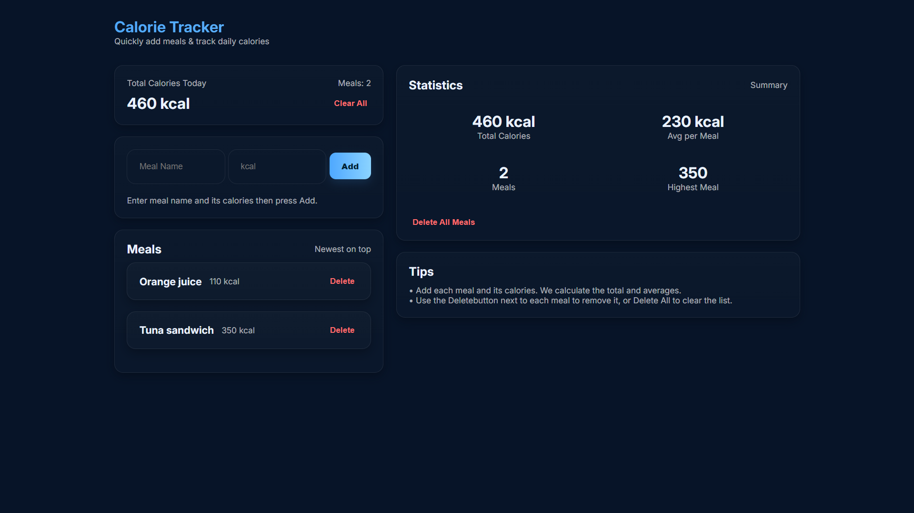

# 🥗 Mini Calorie Tracker

Track your daily meals and stay aware of your calorie intake with a clean and responsive Angular application.



---

## ✨ Features

- ➕ Add, delete, and display meals instantly
- 🔥 Auto-calculated statistics (Total, Average, Highest calories)
- 💾 Persistent data using LocalStorage
- 📱 Fully responsive UI built with SCSS

---

## 🧰 Tech Stack

| Technology | Usage |
|------------|-------|
| Angular    | Main framework |
| TypeScript | App logic & typing |
| SCSS       | Styling & layout |
| LocalStorage | Saves data in the browser |

---

## 🚀 Getting Started

Clone the repo and run the project locally:

```bash
git clone https://github.com/SeifAkmal/mini-calorie-tracker.git
cd mini-calorie-tracker
npm install
ng serve

**Open Locally:**  
➡️ [http://localhost:4200/](http://localhost:4200/)

**Live Demo:**  
🌐 [https://mini-calories-tracker.netlify.app/](https://mini-calories-tracker.netlify.app/)


